# Land Use and Land Cover Classification from Satellite Imagery Using CNN and Transfer Learning on the EuroSAT Dataset

This project trains and evaluates convolutional neural networks for land use and land cover classification on the RGB version of the EuroSAT satellite imagery dataset. It uses transfer learning with ImageNet-pretrained CNN backbones, stratified train/validation/test splits, reproducible PyTorch training, and a complete evaluation pipeline with metrics, plots, model comparison reports, and misclassification inspection.

The work was developed around a notebook-first workflow for Google Colab experimentation, then organized into reusable scripts and modules for repeatable local or GPU-server execution. Training was designed for high-memory NVIDIA GPU infrastructure; in our runs, models were trained on rented NVIDIA RTX 6000-class hardware with approximately 100 GB VRAM available.

## Table of Contents

- [Project Overview](#project-overview)
- [Results Summary](#results-summary)
- [Visual Outputs](#visual-outputs)
- [Dataset](#dataset)
- [Methodology](#methodology)
- [Repository Structure](#repository-structure)
- [Setup](#setup)
- [How to Run](#how-to-run)
- [Configuration](#configuration)
- [Outputs](#outputs)
- [Model Architectures](#model-architectures)
- [Training Details](#training-details)
- [Evaluation Details](#evaluation-details)
- [Notebook and Colab Workflow](#notebook-and-colab-workflow)
- [Troubleshooting](#troubleshooting)

## Project Overview

Land use and land cover classification is a remote sensing task with applications in agriculture, urban planning, environmental monitoring, infrastructure analysis, and disaster response. This project classifies Sentinel-2 satellite image patches from EuroSAT into ten land-cover categories:

| Label | Class |
|---:|---|
| 0 | AnnualCrop |
| 1 | Forest |
| 2 | HerbaceousVegetation |
| 3 | Highway |
| 4 | Industrial |
| 5 | Pasture |
| 6 | PermanentCrop |
| 7 | Residential |
| 8 | River |
| 9 | SeaLake |

Core features:

- RGB EuroSAT image classification with PyTorch and torchvision.
- Stratified `70/15/15` train/validation/test split.
- Transfer learning from ImageNet-pretrained CNN backbones.
- Two-phase training: frozen feature extractor, then full fine-tuning.
- Class-weighted cross-entropy for class imbalance.
- Checkpoint resume, best-checkpoint tracking, early stopping, LR scheduling, and optional `torch.compile`.
- Full evaluation with accuracy, precision, recall, F1, AUC, confusion matrices, ROC curves, training curves, inference latency, model comparison, and misclassification examples.

## Results Summary

The current generated results include fine-tuned checkpoints for `vgg16_bn` and `mobilenet_v2`. The evaluation was run on the held-out `splits/test.csv` set with 4,050 images.

| Model | Accuracy | F1 Macro | AUC Macro | Precision Macro | Inference ms/image | Parameters |
|---|---:|---:|---:|---:|---:|---:|
| VGG16-BN | 0.9669 | 0.9665 | 0.9993 | 0.9667 | 139.74 | 134.3M |
| MobileNetV2 | 0.9526 | 0.9511 | 0.9986 | 0.9523 | 27.97 | 2.9M |

Current best model by test accuracy: **VGG16-BN**.

MobileNetV2 is substantially smaller and faster, while still reaching strong test accuracy. VGG16-BN currently gives the highest accuracy in the saved results.

## Visual Outputs

### Exploratory Data Analysis

Class distribution:

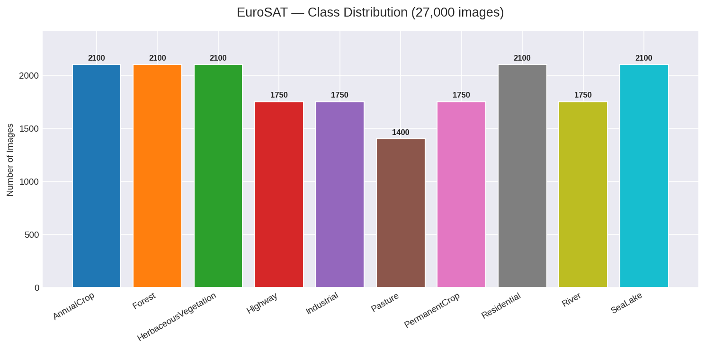

Random training samples by class:

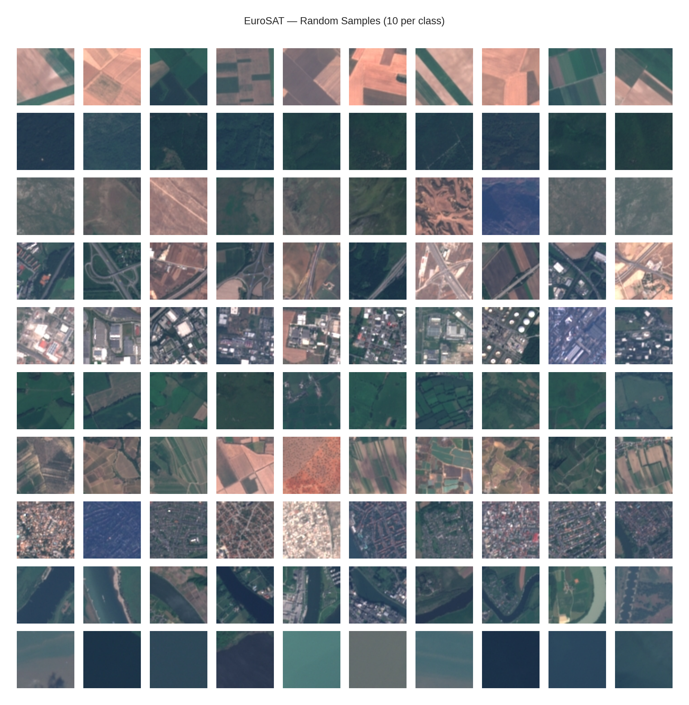

Per-class RGB pixel intensity distributions:

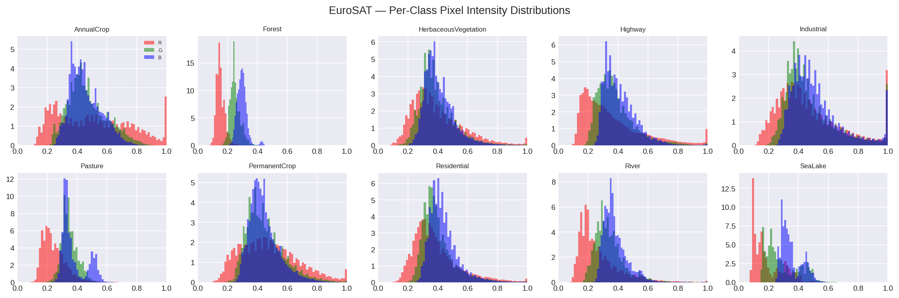

### Model Comparison

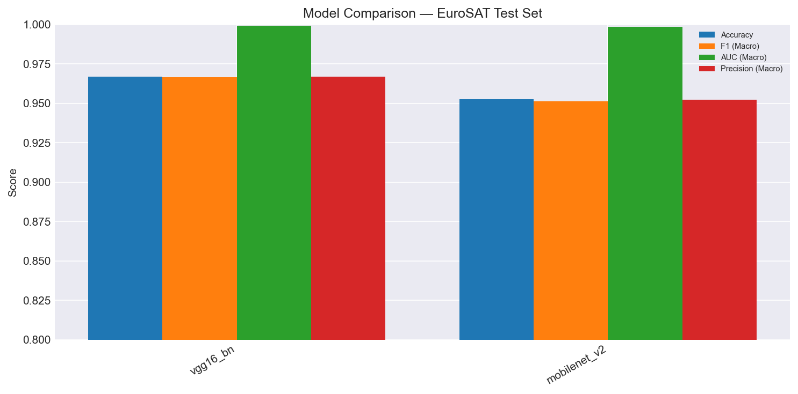

### VGG16-BN Evaluation

Confusion matrix:

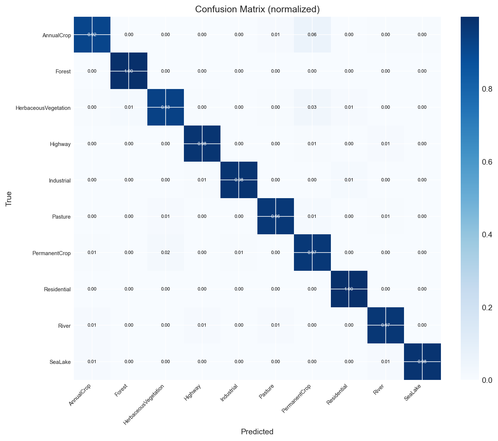

ROC curves:

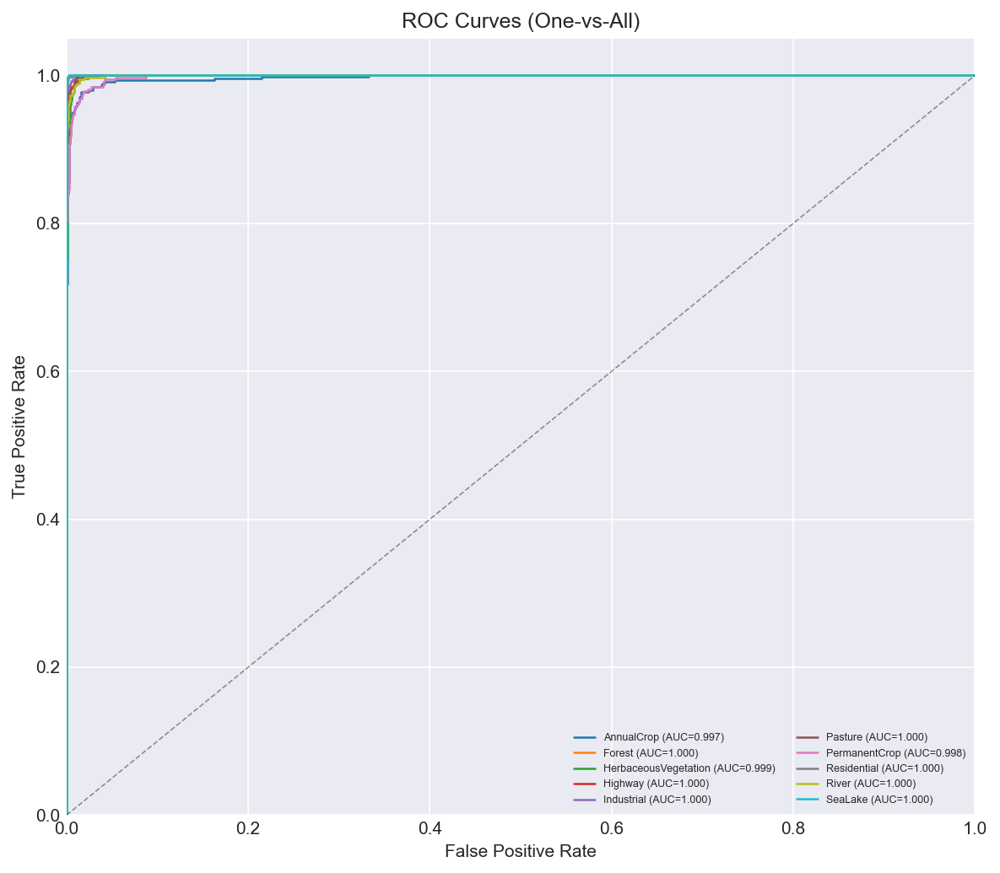

Training curves:

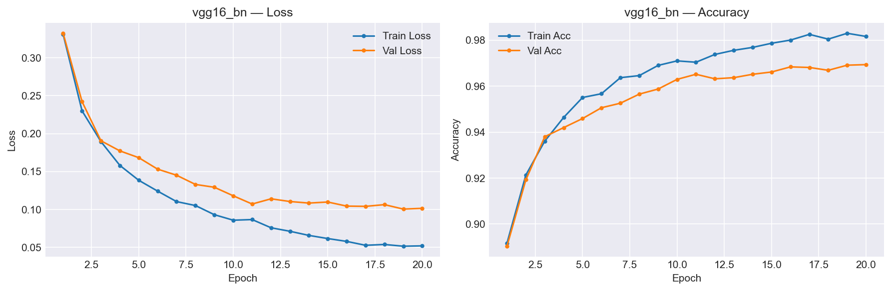

High-confidence misclassifications:

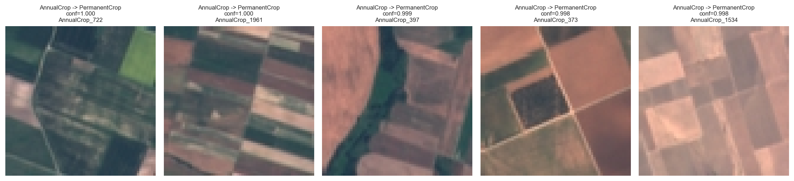

### MobileNetV2 Evaluation

Confusion matrix:

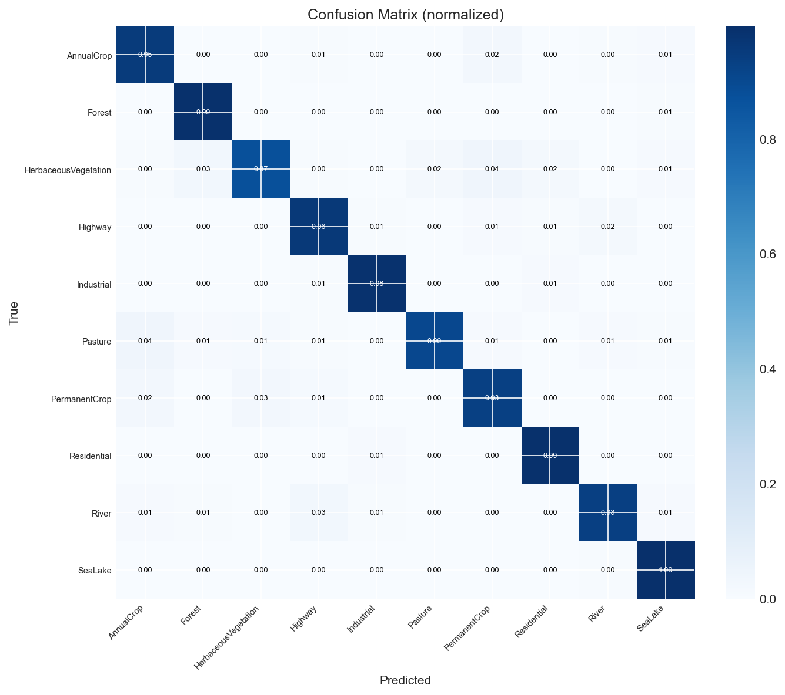

ROC curves:

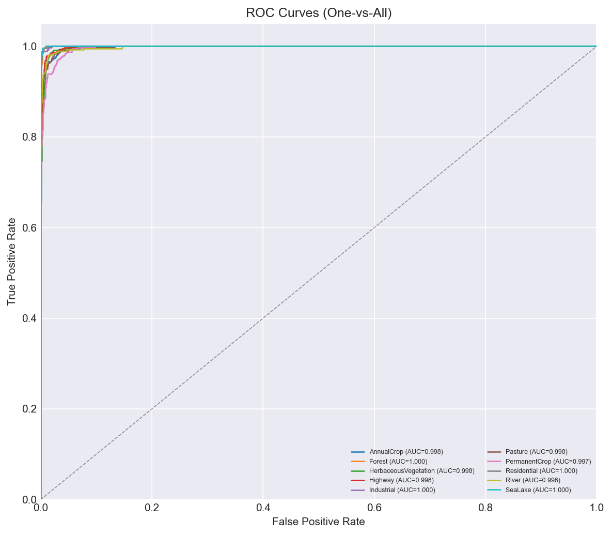

Training curves:

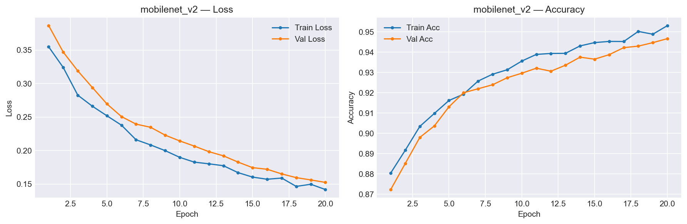

High-confidence misclassifications:

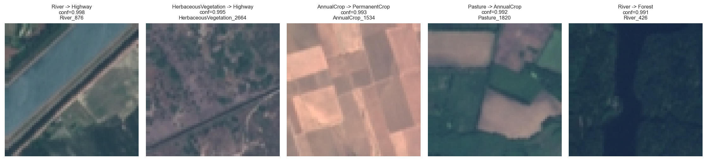

## Dataset

This project uses the **RGB version of EuroSAT**, a Sentinel-2 satellite image dataset for land use and land cover classification.

Dataset characteristics:

- 27,000 RGB images.
- 10 land use / land cover classes.
- 64 x 64 pixel image patches.
- Images stored in class-specific folders under `dataset/`.
- Labels stored in `dataset/label_map.json`.

Expected dataset layout:

```text
dataset/
|-- AnnualCrop/
|-- Forest/
|-- HerbaceousVegetation/
|-- Highway/
|-- Industrial/
|-- Pasture/
|-- PermanentCrop/
|-- Residential/
|-- River/
|-- SeaLake/
|-- dataset.md
`-- label_map.json
```

Class distribution:

| Class | Total | Train | Validation | Test |
|---|---:|---:|---:|---:|
| AnnualCrop | 3,000 | 2,100 | 450 | 450 |
| Forest | 3,000 | 2,100 | 450 | 450 |
| HerbaceousVegetation | 3,000 | 2,100 | 450 | 450 |
| Highway | 2,500 | 1,750 | 375 | 375 |
| Industrial | 2,500 | 1,750 | 375 | 375 |
| Pasture | 2,000 | 1,400 | 300 | 300 |
| PermanentCrop | 2,500 | 1,750 | 375 | 375 |
| Residential | 3,000 | 2,100 | 450 | 450 |
| River | 2,500 | 1,750 | 375 | 375 |
| SeaLake | 3,000 | 2,100 | 450 | 450 |
| **Total** | **27,000** | **18,900** | **4,050** | **4,050** |

CSV split files are generated under `splits/` with this schema:

```text
index,filename,label,className
```

Example:

```csv
index,filename,label,className
0,dataset/PermanentCrop/PermanentCrop_1526.jpg,6,PermanentCrop
```

## Methodology

The pipeline has four main stages:

1. **Split generation**: `scripts/01_generate_csv.py` scans `dataset/`, reads `dataset/label_map.json`, and writes stratified `train.csv`, `val.csv`, and `test.csv` manifests.
2. **EDA**: `scripts/02_eda.py` produces visual and tabular dataset summaries under `outputs/eda/`.
3. **Training**: `scripts/03_train.py` trains one model or all registered models using transfer learning and optional fine-tuning.
4. **Evaluation**: `scripts/04_evaluate.py` evaluates available checkpoints on `splits/test.csv` and writes model-level metrics, plots, reports, and misclassification examples.

Preprocessing:

- Images are loaded as RGB.
- Training images are resized to `224 x 224`.
- Training augmentation includes horizontal flips, random rotation, and color jitter.
- Validation and test transforms use deterministic resize, tensor conversion, and ImageNet normalization.

Transfer learning strategy:

- Load torchvision ImageNet-pretrained weights.
- Replace the classifier head for 10 EuroSAT classes.
- Train the classifier head with a frozen backbone.
- Fine-tune the full model when `training.fine_tune: true`.

## Repository Structure

```text
eurosat-cnn/
|-- config/
|   `-- config.yaml                 # Central paths, split ratios, training hyperparameters
|-- dataset/                        # RGB EuroSAT image folders and label map
|-- docs/
|   `-- plan.md                     # Original project plan and research framing
|-- notebooks/
|   `-- eurosat_pipeline.ipynb      # Notebook workflow for Colab-style experimentation
|-- outputs/
|   |-- checkpoints/                # Model checkpoints and training histories
|   |-- eda/                        # Dataset analysis outputs
|   |-- metrics/                    # Per-model JSON metrics
|   |-- plots/                      # Confusion, ROC, training, and misclassification plots
|   `-- report/                     # Model comparison and misclassification CSVs
|-- scripts/
|   |-- 01_generate_csv.py          # Generate stratified CSV split manifests
|   |-- 02_eda.py                   # Exploratory data analysis
|   |-- 03_train.py                 # Train one model or all registered models
|   `-- 04_evaluate.py              # Evaluate checkpoints on the test split
|-- splits/
|   |-- train.csv
|   |-- val.csv
|   `-- test.csv
|-- src/
|   |-- data/                       # Dataset and transforms
|   |-- evaluation/                 # Metrics and plotting helpers
|   |-- models/                     # CNN model factory
|   `-- training/                   # Training config and loop
|-- pyproject.toml
|-- uv.lock
`-- README.md
```

## Setup

### Requirements

- Python 3.12 or newer.
- PyTorch and torchvision.
- A local copy of the RGB EuroSAT dataset in `dataset/`.
- A CUDA GPU is recommended for training. CPU execution works for evaluation but can be slow, especially for VGG.

Dependencies are declared in `pyproject.toml`:

- `torch`
- `torchvision`
- `numpy`
- `pandas`
- `pillow`
- `pyyaml`
- `scikit-learn`
- `matplotlib`
- `seaborn`
- `tqdm`

### Install with uv

```bash
uv sync
```

Run commands with:

```bash
uv run python scripts/04_evaluate.py
```

### Install with pip

```bash
python -m venv .venv
source .venv/bin/activate
pip install -e .
```

Run commands with:

```bash
python scripts/04_evaluate.py
```

## How to Run

### 1. Generate train/validation/test splits

```bash
python scripts/01_generate_csv.py
```

Outputs:

- `splits/train.csv`
- `splits/val.csv`
- `splits/test.csv`

### 2. Run exploratory data analysis

```bash
python scripts/02_eda.py
```

Outputs:

- `outputs/eda/class_distribution.png`
- `outputs/eda/sample_grid.png`
- `outputs/eda/pixel_histograms.png`
- `outputs/eda/channel_stats.json`
- `outputs/eda/split_summary.csv`

### 3. Train a single model

```bash
python scripts/03_train.py --model mobilenet_v2
```

Available model names:

```text
vgg16_bn
resnet50
densenet121
efficientnet_b0
mobilenet_v2
```

### 4. Train all registered models

```bash
python scripts/03_train.py --all
```

### 5. Start training from scratch

By default, training resumes from checkpoint files when available. Use `--no-resume` to ignore previous checkpoints:

```bash
python scripts/03_train.py --model vgg16_bn --no-resume
```

### 6. Train only the frozen-backbone phase

```bash
python scripts/03_train.py --model mobilenet_v2 --phase1-only
```

### 7. Evaluate trained checkpoints

```bash
python scripts/04_evaluate.py
```

The evaluation script checks all registered model names and skips models without checkpoints.

### 8. Save a custom number of misclassification examples

```bash
python scripts/04_evaluate.py --num-misclassifications 5
```

The script saves the highest-confidence wrong predictions for each evaluated model.

## Configuration

All main paths and hyperparameters live in `config/config.yaml`.

Important settings:

```yaml
splits:
  ratios:
    train: 0.70
    val: 0.15
    test: 0.15
  random_seed: 42

training:
  batch_size: 512
  fine_tune: true
  phase1:
    epochs: 10
    learning_rate: 1.0e-3
  phase2:
    epochs: 20
    learning_rate: 1.0e-5
  weight_decay: 1.0e-4
  early_stopping_patience: 5
  scheduler_factor: 0.5
  scheduler_patience: 3
  dropout: 0.3

model:
  input_size: 224
  num_classes: 10
  head_hidden_dim: 512
```

The default batch size is large and was chosen for high-memory GPU training. Reduce `training.batch_size` if you train on smaller GPUs or CPU.

## Outputs

### Checkpoints

Saved in `outputs/checkpoints/`.

Common files:

- `{model}_checkpoint.pt`: full resume checkpoint for the current phase.
- `{model}_best.pt`: best frozen-backbone model weights.
- `{model}_history.json`: frozen-backbone training history.
- `{model}_ft_checkpoint.pt`: full resume checkpoint for fine-tuning.
- `{model}_ft_best.pt`: best fine-tuned model weights.
- `{model}_ft_history.json`: fine-tuning history.

Current checkpointed models:

- `vgg16_bn`
- `mobilenet_v2`

### Metrics

Saved in `outputs/metrics/`.

Current files:

- `outputs/metrics/vgg16_bn.json`
- `outputs/metrics/mobilenet_v2.json`

Each metrics file includes:

- accuracy
- macro precision
- macro recall
- macro F1
- macro AUC
- per-class precision, recall, and F1
- per-class AUC
- inference milliseconds per image
- total parameter count
- trainable parameter count

### Plots

Saved in `outputs/plots/`.

Current files:

- `vgg16_bn_confusion.png`
- `vgg16_bn_roc.png`
- `vgg16_bn_training.png`
- `vgg16_bn_misclassifications.png`
- `mobilenet_v2_confusion.png`
- `mobilenet_v2_roc.png`
- `mobilenet_v2_training.png`
- `mobilenet_v2_misclassifications.png`

### Reports

Saved in `outputs/report/`.

Current files:

- `model_comparison.csv`
- `model_comparison.png`
- `vgg16_bn_misclassifications.csv`
- `mobilenet_v2_misclassifications.csv`

Misclassification CSV columns:

```text
test_index,filename,true_label,true_class,pred_label,pred_class,pred_confidence,true_class_probability,top3_classes,top3_probabilities
```

## Model Architectures

The model factory is implemented in `src/models/factory.py`.

Supported backbones:

| Model | Torchvision weights | Classifier replacement |
|---|---|---|
| `vgg16_bn` | `VGG16_BN_Weights.IMAGENET1K_V1` | final classifier layer |
| `resnet50` | `ResNet50_Weights.IMAGENET1K_V2` | custom MLP head |
| `densenet121` | `DenseNet121_Weights.IMAGENET1K_V1` | custom MLP head |
| `efficientnet_b0` | `EfficientNet_B0_Weights.IMAGENET1K_V1` | custom MLP head |
| `mobilenet_v2` | `MobileNet_V2_Weights.IMAGENET1K_V1` | custom MLP head |

The shared MLP classifier head used for most architectures is:

```text
Dropout -> Linear(input_features, 512) -> ReLU -> Dropout -> Linear(512, 10)
```

VGG16-BN replaces the final classifier layer directly with a 10-class linear output.

## Training Details

Training entry point: `scripts/03_train.py`.

The training loop includes:

- AdamW optimizer.
- Class-weighted cross-entropy loss.
- ReduceLROnPlateau scheduler.
- Early stopping on validation loss.
- Checkpoint resume.
- Best model saving by validation loss.
- CUDA AMP when training on CUDA.
- Optional `torch.compile` support from config.

Training phases:

1. **Phase 1: frozen backbone**
   - Backbone parameters are frozen.
   - The classification head is trained.
   - Default: 10 epochs at learning rate `1e-3`.

2. **Phase 2: fine-tuning**
   - The full model is unfrozen.
   - Phase 1 best weights are loaded.
   - Default: 20 epochs at learning rate `1e-5`.

Device selection:

1. CUDA if available.
2. Apple MPS if available.
3. CPU fallback.

## Evaluation Details

Evaluation entry point: `scripts/04_evaluate.py`.

For each registered model, evaluation prefers the fine-tuned checkpoint:

```text
outputs/checkpoints/{model}_ft_best.pt
```

If the fine-tuned checkpoint is missing, it falls back to:

```text
outputs/checkpoints/{model}_best.pt
```

If neither exists, the model is skipped.

The evaluation pipeline computes:

- aggregate metrics
- per-class metrics
- one-vs-all ROC/AUC
- confusion matrix
- training history plot
- model comparison table and chart
- high-confidence misclassification examples from `splits/test.csv`

The misclassification viewer is useful for qualitative error analysis. It selects the wrong predictions with the highest predicted confidence, then writes both a CSV report and a visual image grid using the original RGB files.

## Notebook and Colab Workflow

The notebook workflow lives in:

```text
notebooks/eurosat_pipeline.ipynb
```

The intended workflow was:

1. Use the notebook for exploration and Google Colab execution.
2. Mount or upload the RGB EuroSAT dataset.
3. Validate the split, transforms, and training loop interactively.
4. Train on rented NVIDIA RTX 6000-class GPU hardware with high VRAM availability.
5. Persist checkpoints and generated outputs.
6. Re-run evaluation scripts to produce final metrics and report artifacts.

For Colab-style runs, make sure paths in `config/config.yaml` match the mounted dataset and output directory. The scripts are written with relative paths, so running from the project root is the simplest setup.

## Reproducibility

The project uses `config/config.yaml` as the source of truth for paths, split ratios, random seed, model input size, and training settings.

Reproducibility controls:

- Split seed: `splits.random_seed: 42`.
- Training seed: `reproducibility.seed: 42`.
- Stratified train/validation/test splitting.
- Saved CSV manifests for fixed sample membership.
- Saved best checkpoints and training histories.

Exact floating-point results can still vary across hardware, CUDA versions, PyTorch versions, and nondeterministic GPU kernels.

## Troubleshooting

### The dataset cannot be found

Check that `config/config.yaml` points to the correct dataset root:

```yaml
dataset:
  root: "dataset"
```

The project expects class folders directly under that directory.

### Training runs out of memory

Reduce the batch size:

```yaml
training:
  batch_size: 128
```

VGG16-BN is large. MobileNetV2 is a better starting point for smaller GPUs.

### Evaluation is slow

Evaluation falls back to CPU if CUDA and MPS are not available. VGG16-BN can be slow on CPU. Use a CUDA runtime for faster inference.

### Some models are skipped during evaluation

This is expected when checkpoints are missing. Train the model first:

```bash
python scripts/03_train.py --model resnet50
```

Then rerun:

```bash
python scripts/04_evaluate.py
```

### Matplotlib cache warnings

In restricted environments, Matplotlib may warn that the default cache directory is not writable. Set `MPLCONFIGDIR` to a writable directory:

```bash
mkdir -p .cache/matplotlib
MPLCONFIGDIR=.cache/matplotlib python scripts/04_evaluate.py
```

## License and Citation

This repository is an academic machine learning project built around the EuroSAT RGB dataset and pretrained CNN models from torchvision. When publishing or presenting results, cite the EuroSAT dataset and any model/backbone sources required by your institution or venue.
